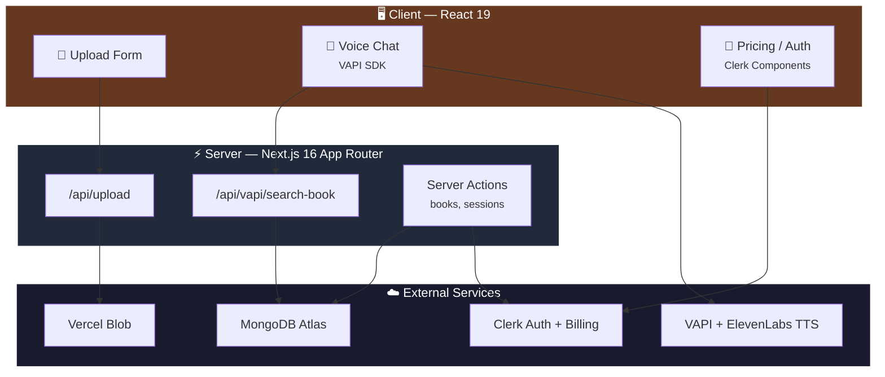

<div align="center">


<br/>

<a href="#"></a>

<br/><br/>

<p>
  <a href="#-getting-started"></a>
  <a href="#-features"></a>
  <a href="#-subscription-plans"></a>
</p>

<br/>

<p>
  
</p>

<br/>


</div>


## ✨ Features

- **PDF Upload & Processing** — Upload any PDF book. The app extracts text, generates a cover image from the first page, and splits content into searchable segments.
- **Voice Conversations** — Talk to an AI assistant that has read your entire book. Ask questions, discuss themes, request summaries — all through natural voice.
- **Real-Time Transcripts** — See your conversation as it happens with live speech-to-text and AI response streaming.
- **Multiple AI Voices** — Choose from 5 distinct ElevenLabs voices (Dave, Daniel, Chris, Rachel, Sarah) for each book.
- **Full-Text Search** — MongoDB text indexing with regex fallback enables the AI to find relevant passages instantly.
- **Subscription Plans** — Three-tier billing (Free, Standard, Pro) managed through Clerk Billing with plan enforcement on book uploads and voice sessions.
- **Cloud Storage** — PDFs and cover images stored on Vercel Blob for reliable, fast delivery.
- **Authentication** — Secure sign-in/sign-up powered by Clerk with protected routes.


## 🏗️ Architecture




## 🚀 Getting Started

### Prerequisites

- Node.js 18+
- npm
- A MongoDB Atlas cluster
- Accounts on: [Clerk](https://clerk.com), [VAPI](https://vapi.ai), [Vercel](https://vercel.com) (for Blob storage)

### 1. Clone & Install

```bash
git clone https://github.com/your-username/bookified.git
cd bookified
npm install
```

### 2. Environment Variables

Create a `.env.local` file in the root:

```env
# Clerk
NEXT_PUBLIC_CLERK_PUBLISHABLE_KEY=pk_...
CLERK_SECRET_KEY=sk_...

# Clerk Auth Routes
NEXT_PUBLIC_CLERK_SIGN_IN_URL=/sign-in
NEXT_PUBLIC_CLERK_SIGN_UP_URL=/sign-up

# MongoDB
MONGODB_URI=mongodb+srv://...

# Vercel Blob Storage
BLOB_READ_WRITE_TOKEN=vercel_blob_...

# VAPI Voice AI
NEXT_PUBLIC_ASSISTANT_ID=your_vapi_assistant_id
NEXT_PUBLIC_VAPI_API_KEY=your_vapi_public_key
```

### 3. Run Development Server

```bash
npm run dev
```

Open [http://localhost:3000](http://localhost:3000) in your browser.

### 4. Build for Production

```bash
npm run build
npm start
```


## 📁 Project Structure

```
bookified/
├── app/
│   ├── (root)/
│   │   ├── page.tsx             # Home — book library
│   │   ├── books/
│   │   │   ├── new/page.tsx     # Upload a new book
│   │   │   └── [slug]/page.tsx  # Book reader + voice chat
│   │   └── subscription/
│   │       └── page.tsx         # Pricing table
│   ├── api/
│   │   ├── upload/route.ts      # File upload to Vercel Blob
│   │   └── vapi/
│   │       └── search-book/route.ts  # VAPI tool — search book content
│   ├── globals.css              # Design system + component styles
│   └── layout.tsx               # Root layout with ClerkProvider
│
├── components/
│   ├── BookCard.tsx              # Book preview card
│   ├── HeroSection.tsx           # Homepage hero
│   ├── LoadingOverlay.tsx        # Full-screen loading state
│   ├── Navbar.tsx                # Navigation bar
│   ├── Transcript.tsx            # Real-time conversation display
│   ├── UploadForm.tsx            # PDF upload + metadata form
│   ├── VapiControls.tsx          # Voice session controls
│   └── ui/                       # shadcn/ui primitives
│
├── database/
│   ├── models/
│   │   ├── book.model.ts         # Book schema
│   │   ├── bookSegment.model.ts  # Text segment schema (searchable)
│   │   └── voiceSession.model.ts # Voice session tracking
│   └── mongoose.ts               # Connection with caching
│
├── hooks/
│   └── useVapi.ts                # Voice call lifecycle hook
│
├── lib/
│   ├── actions/
│   │   ├── book.actions.ts       # Book CRUD server actions
│   │   └── session.actions.ts    # Voice session server actions
│   ├── constants.ts              # App constants, voice config
│   ├── subscription-constants.ts # Plan limits & billing period
│   ├── subscription.ts           # Plan checks via Clerk has()
│   ├── utils.ts                  # PDF parsing, slug gen, helpers
│   └── zod.ts                    # Form validation schemas
│
├── types.d.ts                    # Global type definitions
└── public/assets/                # Static images & illustrations
```


## 💳 Subscription Plans

<div align="center">

| | **Free** | **Standard** | **Pro** |
|:--|:--:|:--:|:--:|
| |  |  |  |
| **Books** | 5 | 10 | 100 |
| **Voice Sessions / Month** | 5 | 100 | Unlimited |
| **Max Session Duration** | 15 min | 30 min | 60 min |

</div>

> Plans are configured in the Clerk Dashboard with slugs `free_user`, `standard`, and `pro`. Enforcement happens server-side in the book creation and session start actions using Clerk's `has()` method.


## 🔊 How Voice Conversations Work


<details>
<summary><strong>Step-by-step breakdown</strong></summary>

1. User opens a book and clicks the microphone button
2. A `VoiceSession` record is created (after plan limit checks)
3. The VAPI SDK connects to the configured AI assistant with the selected ElevenLabs voice
4. When the user speaks, VAPI transcribes and sends to the LLM
5. The LLM calls the `/api/vapi/search-book` tool to find relevant book passages
6. MongoDB text search (with regex fallback) returns the top matching segments
7. The AI generates a contextual response, which is spoken back via ElevenLabs TTS
8. The full transcript is displayed in real-time on screen

</details>


## 🛠️ Tech Stack

| Layer          | Technology                                              |
|----------------|---------------------------------------------------------|
| Framework      | [Next.js 16](https://nextjs.org) (App Router, Turbopack) |
| UI             | [React 19](https://react.dev), [Tailwind CSS 4](https://tailwindcss.com), [shadcn/ui](https://ui.shadcn.com) |
| Language       | [TypeScript 5](https://www.typescriptlang.org)          |
| Database       | [MongoDB Atlas](https://www.mongodb.com/atlas) + [Mongoose 9](https://mongoosejs.com) |
| Auth & Billing | [Clerk](https://clerk.com) (authentication + subscription billing) |
| Voice AI       | [VAPI](https://vapi.ai) (orchestration) + [ElevenLabs](https://elevenlabs.io) (TTS) |
| File Storage   | [Vercel Blob](https://vercel.com/docs/storage/vercel-blob) |
| PDF Parsing    | [PDF.js](https://mozilla.github.io/pdf.js/) (client-side) |
| Forms          | [React Hook Form](https://react-hook-form.com) + [Zod](https://zod.dev) |


## 📜 Scripts

| Command         | Description                    |
|-----------------|--------------------------------|
| `npm run dev`   | Start development server       |
| `npm run build` | Create production build         |
| `npm start`     | Start production server         |
| `npm run lint`  | Run ESLint                      |


## 🚢 Deployment

The app is designed for [Vercel](https://vercel.com):

1. Push your repo to GitHub
2. Import the project in the Vercel dashboard
3. Add all environment variables from `.env.local`
4. Deploy — Vercel handles the build, SSR, and Blob storage automatically


## 📄 License

This project is for educational and personal use.

<br/>

<div align="center">


<br/>

<p>
  <a href="#"></a>
</p>

</div>
